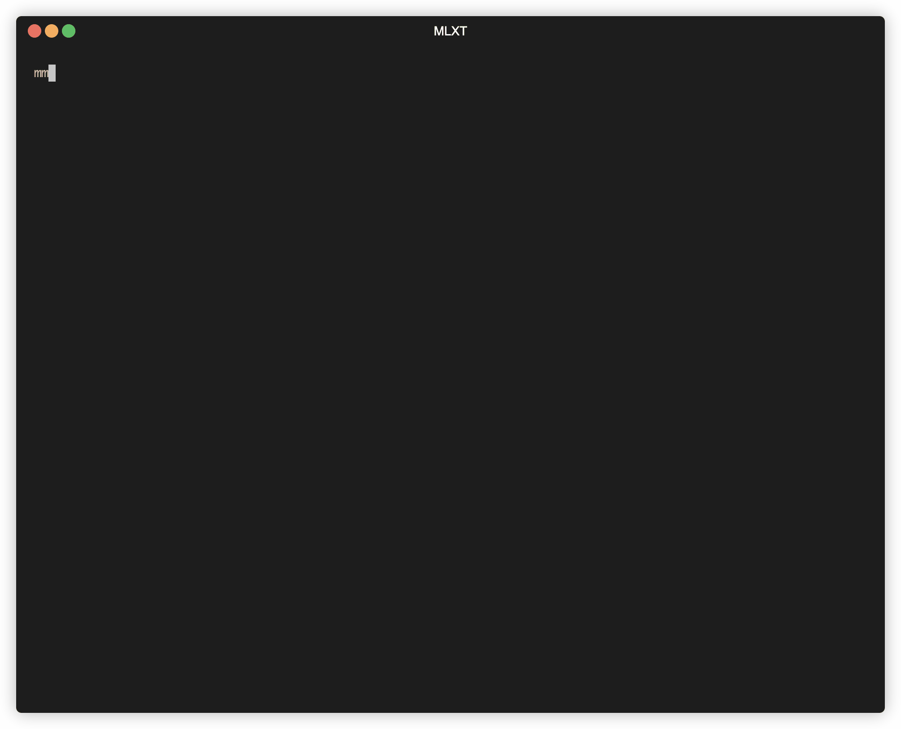

# mlx-training-rs

<p align="center">
  
</p>

A CLI to generate __synthetic__ data for MLX fine-tuning. The CLI is largely translated from the php version [here](https://apeatling.com/articles/simple-guide-to-local-llm-fine-tuning-on-a-mac-with-mlx/?utm_source=pocket_reader).

## Demo

<p align="center">
  
</p>

## QLoRa fine-tuning for dummies on Apple Silicon

Based on [this](https://apeatling.com/articles/simple-guide-to-local-llm-fine-tuning-on-a-mac-with-mlx/?utm_source=pocket_reader), [this](https://www.reddit.com/r/LocalLLaMA/comments/191s7x3/a_simple_guide_to_local_llm_finetuning_on_a_mac/?share_id=hH4Vu8gxZgwYRvl_fIyOu&utm_content=1&utm_medium=ios_app&utm_name=ioscss&utm_source=share&utm_term=1), [this](https://www.reddit.com/r/LocalLLaMA/comments/18ujt0n/using_gpus_on_a_mac_m2_max_via_mlx_update_on/) and [this](https://www.reddit.com/r/LocalLLaMA/comments/18wabkc/lessons_learned_so_far_lora_fine_tuning_on/).

### Preparing

Install HomeBrew, it's a package manager that help use to install all other dependencies.

```shell
/bin/bash -c "$(curl -fsSL https://raw.githubusercontent.com/Homebrew/install/HEAD/install.sh)"
```

Setting up Python3 (if you haven't)
```shell
brew install python@3.11
```

Clone MLX and download the model for fine-tuning.
```sh
git clone https://github.com/ml-explore/mlx-examples.git
```

Download and convert [Mistral-7B-Instruct-v0.2](https://huggingface.co/mistralai/Mistral-7B-Instruct-v0.2).

```sh
cd mlx-examples/llm/hf-lllm
pip install -r requirements.txt # or pip3
python convert.py --hf-path mistralai/Mistral-7B-Instruct-v0.2 -q --mlx-path ./Mistral-7B-Instruct-v0.2-mlx-4bit
```
We are adding `-q` for coverting into a 4-bit quantized MLX model to `./Mistral-7B-Instruct-v0.2-mlx-4bit`

It will tale some time...

The converted MLX version has something we don't need when fine-tuning the model, edit `./Mistral-7B-Instruct-v0.2-mlx-4bit/config.json`, replace all with:

```json
{
    "vocab_size": 32000,
    "max_position_embeddings": 32768,
    "hidden_size": 4096,
    "intermediate_size": 14336,
    "num_hidden_layers": 32,
    "num_attention_heads": 32,
    "sliding_window": null,
    "num_key_value_heads": 8,
    "hidden_act": "silu",
    "initializer_range": 0.02,
    "rms_norm_eps": 1e-05,
    "use_cache": true,
    "rope_theta": 1000000.0,
    "attention_dropout": 0.0,
    "return_dict": true,
    "output_hidden_states": false,
    "output_attentions": false,
    "torchscript": false,
    "torch_dtype": "bfloat16",
    "use_bfloat16": false,
    "tf_legacy_loss": false,
    "pruned_heads": {},
    "tie_word_embeddings": false,
    "is_encoder_decoder": false,
    "is_decoder": false,
    "cross_attention_hidden_size": null,
    "add_cross_attention": false,
    "tie_encoder_decoder": false,
    "max_length": 20,
    "min_length": 0,
    "do_sample": false,
    "early_stopping": false,
    "num_beams": 1,
    "num_beam_groups": 1,
    "diversity_penalty": 0.0,
    "temperature": 1.0,
    "top_k": 50,
    "top_p": 1.0,
    "typical_p": 1.0,
    "repetition_penalty": 1.0,
    "length_penalty": 1.0,
    "no_repeat_ngram_size": 0,
    "encoder_no_repeat_ngram_size": 0,
    "bad_words_ids": null,
    "num_return_sequences": 1,
    "chunk_size_feed_forward": 0,
    "output_scores": false,
    "return_dict_in_generate": false,
    "forced_bos_token_id": null,
    "forced_eos_token_id": null,
    "remove_invalid_values": false,
    "exponential_decay_length_penalty": null,
    "suppress_tokens": null,
    "begin_suppress_tokens": null,
    "architectures": [
        "MistralForCausalLM"
    ],
    "finetuning_task": null,
    "id2label": {
        "0": "LABEL_0",
        "1": "LABEL_1"
    },
    "label2id": {
        "LABEL_0": 0,
        "LABEL_1": 1
    },
    "tokenizer_class": null,
    "prefix": null,
    "bos_token_id": 1,
    "pad_token_id": null,
    "eos_token_id": 2,
    "sep_token_id": null,
    "decoder_start_token_id": null,
    "task_specific_params": null,
    "problem_type": null,
    "model_type": "mistral",
    "quantization": {
        "group_size": 64,
        "bits": 4
    }
}
```

### Generating Training Data

Delete example data in `mlx-examples/lora/data`, you can delete everything inside.

Install `mlxt`, the tool in this repo.
```sh
brew install chenhunghan/homebrew-formulae/mlx-training-rs
```

Generate a training on a topic you are interested in.
```sh
export OPENAI_API_KEY=[don't tell me your key]
mlxt --topic="[the topic you are interested, e.g. Large Language Model]"
```

### Fine-tuning!

```sh
cd mlx-examples/lora
pip install -r requirements.txt # or pip3
python lora.py --train --model ../llms/hf_llm/Mistral-7B-Instruct-v0.2-mlx-4bit --data ./data --batch-size 1 --lora-layers 4
```

To chat with your fine-tuned model, see [here](https://github.com/ml-explore/mlx-examples/tree/main/lora#generate)
